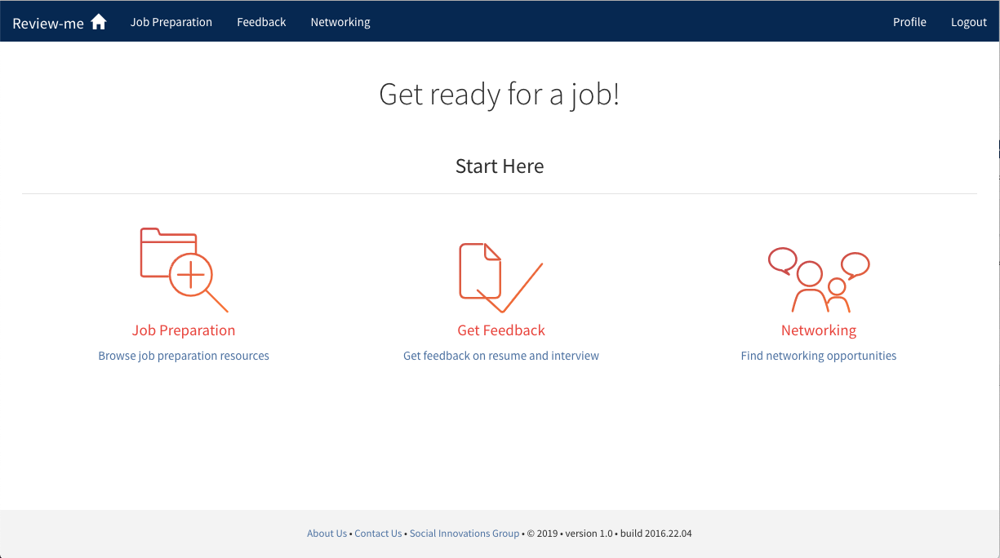
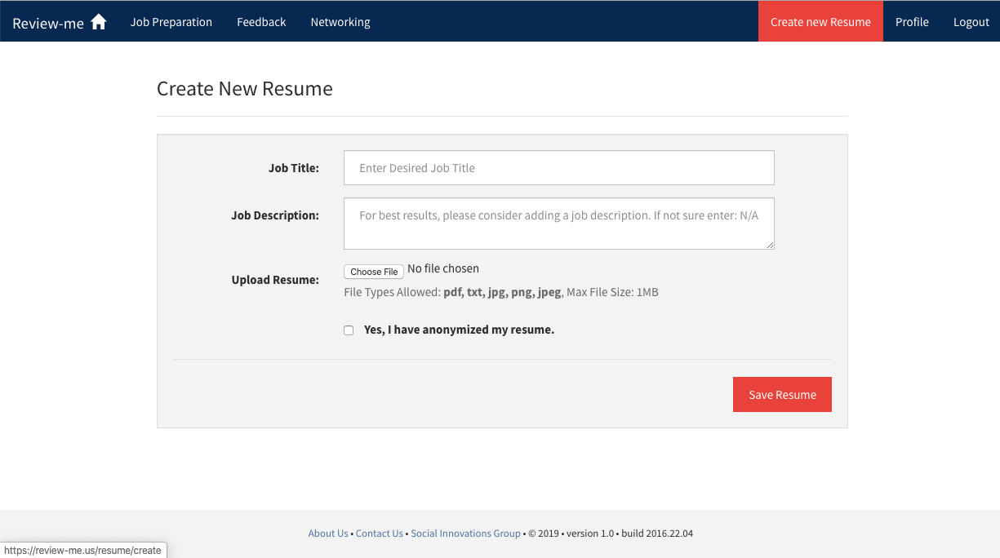

# Review-Me

[Review-Me](https://review-me.us/), i.e.,formerly resume-me, is a system dedicated to provide expert resume feedback for job seekers as well as require reflection from job seekers in order to update their resumes. This system could improve users' attitudes toward the job search by increasing their confidence in their application materials, specifically resumes.

  

## Table of Contents
1. [Installation Instructions](#installation-instructions)
2. [Run the application on your local system](#run-the-application-on-your-local-system)
3. [Coding Standards](#coding-standards)
4. [Git Workflow](#git-workflow)
5. [Author](#author)

## Installation Instructions

#### Mongodb
Ubuntu official repository can be used for installing mongodb but it is advised to install the latest version using the following method.

1. Adding key to validate new mongodb sources
````$ sudo apt-key adv --keyserver hkp://keyserver.ubuntu.com:80 --recv 7F0CEB10````
2. Adding links to repository for installing latest mongodb
````echo "deb http://repo.mongodb.org/apt/ubuntu "$(lsb_release -sc)"/mongodb-org/3.0 multiverse" | sudo tee /etc/apt/sources.list.d/mongodb-org-3.0.list````
3. Update software sources
````sudo apt-get update````
4. Install Mongodb
````sudo apt-get install -y mongodb-org````
5. Check status
````service mongod status````

For installation on Macs, you can use the following method.

1. If you don’t already have a package installer, install one. Homebrew is one example
````$ruby -e "$(curl -fsSL https://raw.githubusercontent.com/Homebrew/install/master/install)" ````
2. If you already have Homebrew, update it
````$brew update````
3. Now install mongodb (the last line of the install output shows you the install location, which you should add to your ~/.bashrc)
````brew install mongodb````
4. MongoDB stores its data in the /data/db directory by default but it does not generate that folder structure for you. So, you have to create that directory.
````$ sudo mkdir -p /data/db````
5. Check status
````mongod status````

#### Python
- Note: The following instructions only need to be done once. After installation, refer to "Run the application on your local system" for instructions on how to launch the app
- Note: This application is based on Python 2.
- Install the following packages: python, python-dev, pip and virtual-environment.
  - Mac: In the terminal, type "sudo easy_install python" (press enter), "sudo easy_install python-dev" (enter), "sudo easy_install pip" (enter) and "pip install virtual-environment"
  - Linux (Ubuntu): "sudo apt-get install python python-dev python-pip python-virtualenv virtualenvwrapper" (enter)
- Clone the repository
- Now, type virtualenv venv
- After the python virtual environment is installed, it has to be activated
- To activate python virtual environment, "source venv/bin/activate"
- To install all remaining python packages in the virtual environment: pip install -r requirements.txt

#### Nodejs, Gulp, Bower
- Install [nodeJS](https://nodejs.org/download/)

For installation on Macs, you'll need to run the first command with "sudo" ; ignore otherwise

- Install Gulp globally
````
$ (sudo) npm install -g gulp
````
- Install Bower globally

-- If on Mac, you will need to run 

````
$ sudo chown -R 'username' ~/.config
````

-- before installing bower--otherwise, you will get an EACCES, permission denied error.

````
$ npm install -g bower
````
- Install npm project dependencies
````
$ npm install
````
- Install bower project dependencies
````
$ bower install
````
- Run Gulp to compile css/js/fonts
````
$ gulp
````

## Run the application on your local system

#### Create Virtual Environment
- Initiate virtual environment
````
vituralenv venv
````
- Install requirements.txt 
````
pip install -r requirements.txt
````

- Activate virtual environment 
````
source venv/bin/activate
````

#### Run MongoDB
````
mongod
````
If you see the error message of "exception in initAndListen: IllegalOperation: Attempted to create a lock file on a read-only directory: /data/db, terminating", please use 
````
sudo mongod
````
How to run MongoDB on mac? https://docs.mongodb.com/manual/tutorial/install-mongodb-on-os-x/
How to run MongoDB on Windows? https://docs.mongodb.com/manual/tutorial/install-mongodb-on-windows/

#### Configure the flask application 
````
python run.py
````
- You may have to create a secret key, the instructions will be provided in the terminal
- After you have run the commands for the secret key re-type "python run.py"
- The server starts and the website is accessible at: http://127.0.0.1:4500/
- To quit the application, use - "CTRL + C"
- To exit the virtual environment, type "deactivate"

## Coding Standards
- Strictly follow PEP8 coding standards
  - You can install [pep8 checkers](https://pypi.python.org/pypi/pep8):
    - Linux (Ubuntu) - sudo apt-get install pep8 python-autopep8
    - OR simply using pip - pip install pep8
- Use the editorconfig file with preferred IDE for consistency


## Git Workflow

#### For smaller bug fixes

1. Clone repository (if you have not already cloned the repository)
Execute: "$ git clone 'reponame'"
2. Create a new branch which is based off origin/master. This is the hotfix branch.
Execute: "$ git checkout -b hotfix origin/master"
3. Make changes and commit. The commit message should be in present tense.
4. Before pushing to remote, fetch changes
Execute: "$ git fetch"
5. If updates to the local repo are required
Execute: "$ git pull --ff origin"
6. If no updates are required
Execute: "$ git push origin hotfix"
7. Go to github.com/reponame
8. Open a pull request against the master branch
9. Assign the pull request to another team member
10. Inform the team member to review code and merge into master

#### For Readme

All steps are the same except, replace name of branch "hotfix" with "readme". For example, if you are making updates 
to the readme (for the first time and don't have a readme branch listed), you will need to Execute: 
"$ git checkout -b readme origin/master". However, if you Execute: "$ git branch -a" and see that you already have a 
readme branch, simply Execute "$git checkout readme".

#### For new features

All steps are the same except, replace name of branch "hotfix" or "readme" with the name of your branch, like "feature-1"

#### For errors
If you have committed something prematurely, you may need to Execute: "$ git reset --hard HEAD" but with caution

#### Stay tuned for more instructions

## Author

This project is created and managed by the [Social Innovations Group](http://socialinnovations.us/), School of Information, the University of Michigan.
